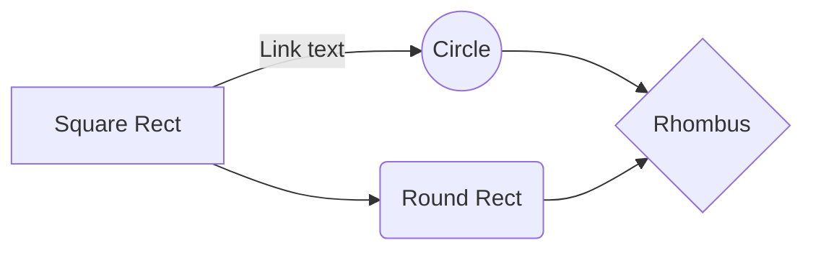

# Base document for all backend features

**Features :** 
- ***Itinéraires***
		- ``Permettre à l'utilisateur de savoir comment se rendre d'un point A à un point B``
- ***Évènements***
		- ``Rendre compte des possibilités culturelles sur place``
- ***Restauration***
		- ``Prendre en compte les besoins usagers en terme de nourriture``
- ***Bars***
		- ``Proposer des activités festives aux usagers``
- ***Transport***
 		- ``Permettre l'utilisation de différent type de transport``
- ***Accommodations***
 		- ``Si nécessaire pouvoir permettre de dormir sur place``

## Properties

| Itinéraires | Évènements | Restauration | Bars | Transport | Accommodations
|--|--|--|--|--|--|
| Départ | Date / Heure | Date / Heure | Date / Heure | Intitulé | Intitulé
| Arrivée | Adresse | Adresse | Adresse | Avis | Type
| Durée | Coût | Coût | Coût | Compagnie | Nb personne Max
| Distance | Intitulé | Intitulé | Intitulé | Coût | Coût par nuit
| Coût | Description | Description | Description | Adresse | Contact
| Type Transport | - | Type de cuisine | Avis | - | Avis
| GeoJS | - | Avis | - | - | -

## UML diagrams

And this will produce a flow chart:

